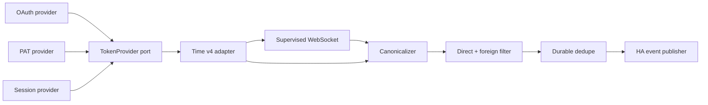
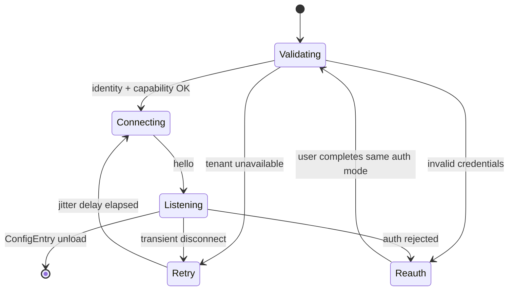

# Architecture Spine — Личные сообщения Time Messenger в Home Assistant

## Design Paradigm

**Hexagonal event-driven pipeline.** Time REST, WebSocket и три способа авторизации являются внешними адаптерами. Они преобразуют wire payload в каноническое `DirectMessage`; чистый pipeline выполняет классификацию и дедупликацию; Home Assistant adapter публикует единственный публичный event. Зависимости направлены к моделям и портам домена.



## Invariants & Rules

### AD-1 — Hexagonal event-driven pipeline

- **Binds:** all
- **Prevents:** смешивание Time wire-протокола, авторизации и lifecycle Home Assistant в одном обработчике.
- **Rule:** adapters зависят от канонических моделей и портов; pipeline не импортирует Home Assistant или Time response-модели; HA publisher является последним adapter.

### AD-2 — [ADOPTED] Одна персональная identity на ConfigEntry

- **Binds:** CAP-1–CAP-6
- **Prevents:** смешивание аккаунтов, reconnect-задач и dedupe-state.
- **Rule:** одна ConfigEntry владеет парой `(normalized_tenant_origin, time_user_id)`; это её `unique_id`. Несколько ConfigEntry разрешены, но runtime и persistent state изолированы по `entry_id`.

### AD-3 — [ADOPTED] Три явных auth adapter за единым портом

- **Binds:** CAP-1
- **Prevents:** скрытый fallback и разветвление REST/WebSocket-клиентов по способу входа.
- **Rule:** пользователь выбирает `oauth`, `pat` или `session`; каждый выдаёт bearer через `TokenProvider`. OAuth использует Home Assistant Application Credentials: `auth_domain` равен normalized tenant origin, а custom `async_get_auth_implementation` строит same-origin `/oauth/authorize` и `/oauth/access_token`; authorization code и refresh обязательны, implicit grant запрещён. OAuth token хранится в ConfigEntry, client credentials — в `application_credentials`; PAT/session bearer — в `ConfigEntry.data`. Session выполняет `POST /api/v4/users/login` с `login_id`, password и опциональным MFA, сохраняет только ответный `Token`; password/MFA никогда не сохраняются.

### AD-4 — Identity и capability gate до запуска listener

- **Binds:** CAP-1, CAP-2
- **Prevents:** запуск listener с токеном другого пользователя, неправильным URL или неподдерживаемым tenant.
- **Rule:** setup нормализует HTTPS origin, выполняет `GET /api/v4/users/me`, затем аутентифицированный `/api/v4/websocket` до `hello`; фиксирует `user_id` и `server_version`. Authenticated REST/WSS не следует redirects и никогда не передаёт bearer на другой origin. Origin после identity binding неизменяем; смена сервера проходит reconfigure и полный gate. HTTP разрешён только loopback test fixtures. Поддержка tenant объявляется только после acceptance probe из AD-12.

### AD-5 — [ADOPTED] Один supervised WebSocket на ConfigEntry

- **Binds:** CAP-2, CAP-6
- **Prevents:** параллельные listener и несовместимые retry-политики.
- **Rule:** ConfigEntry создаёт ровно одну async-задачу после gate. Reconnect использует full jitter в пределах последовательных caps `1, 2, 4, 8, 16, 32, 60` секунд; cap сбрасывается после 60 секунд здорового соединения, не только после `hello`. Unload сначала инвалидирует runtime generation, затем отменяет и ожидает задачу и закрывает socket; late callbacks с прежней generation не публикуют события и не запускают reauth. Auth failure инициирует reauth вместо reconnect loop.

### AD-6 — Только новое чужое сообщение в канале `D`

- **Binds:** CAP-2, CAP-3
- **Prevents:** события для групповых/private каналов, edits, system posts и собственных сообщений.
- **Rule:** pipeline принимает только Time event `posted`, defensively декодирует post, требует обычный пользовательский post с `post.type == ""`, подтверждает channel type `D` из payload либо REST-backed cache и проверяет `post.user_id != account_user_id`. Неизвестные identity, post type или channel type обрабатываются fail-closed. `[ASSUMPTION]` В v1 типы `G`, `P`, `O` исключены.

### AD-7 — Durable check-and-mark до публикации

- **Binds:** CAP-4, CAP-6
- **Prevents:** повторный HA event после replay, reconnect или restart.
- **Rule:** один per-entry async lock атомарно проверяет `post_id`, добавляет его и сохраняет state через Home Assistant `Store` до `async_fire`. Хранятся не более 5000 новейших ID и не дольше 24 часов. Ошибка сохранения запрещает публикацию; пространство ключей уже изолировано ConfigEntry. Это даёт exactly-once suppression для replay после успешной записи и at-most-once при process crash: HA event bus не имеет транзакционного acknowledgement. Стабильный `post_id` всегда доступен downstream-потребителям.

### AD-8 — [ADOPTED] Один версионированный HA event contract

- **Binds:** CAP-5
- **Prevents:** несовместимые event names и payload у независимо созданных автоматизаций.
- **Rule:** публичный event type — `time_messenger_event`; `schema_version=1`; `type=direct_message`. Обязательные плоские поля: `schema_version`, `type`, `config_entry_id`, `account_user_id`, `post_id`, `channel_id`, `sender_user_id`, `message_text`, `text_redacted`, `created_at`; `message_text` имеет тип `string|null`. Privacy option `include_message_text` по умолчанию `false`: до явного opt-in поле равно `null`, а `text_redacted=true`. Допустимы additive optional поля `sender_username`, `root_id`, `file_ids`; удаление или переименование поля требует новой schema version. Raw Time payload, message text и secrets не попадают в logs/diagnostics.

### AD-9 — Единая классификация отказов

- **Binds:** CAP-1, CAP-6
- **Prevents:** retry storms, ложный reauth и утечки чувствительных payload в логах.
- **Rule:** `401` и terminal OAuth refresh failure запускают reauth; DNS/timeout/`5xx` остаются в supervisor retry; `429` уважает `Retry-After` или rate-limit reset; malformed event отбрасывается с redacted debug telemetry; unsupported tenant capability создаёт Repair issue.

### AD-10 — Time v4 изолирован адаптером

- **Binds:** CAP-1–CAP-6
- **Prevents:** распространение wire-схем v4 и будущего v5 по HA integration.
- **Rule:** production-модули вне `api/` не импортируют Time response types. API v5 или tenant deviation получает отдельный adapter и выбирается только явным capability detection.

### AD-11 — Только процесс Home Assistant и исходящий TLS

- **Binds:** operational envelope
- **Prevents:** второго владельца runtime, внешнего broker и нового inbound attack surface.
- **Rule:** integration работает внутри одного HA Core, использует HA-managed `aiohttp` session для HTTPS/WSS, всегда проверяет TLS и получает private CA только через trust store хоста. Опция `verify_ssl: false`, webhook ingress и companion daemon запрещены.

### AD-12 — Tenant acceptance является release gate

- **Binds:** CAP-1–CAP-4, CAP-6
- **Prevents:** заявление поддержки direct WebSocket на основании неполной публичной документации.
- **Rule:** probe на целевом tenant должен подтвердить `hello`, один `posted` для `D`, отбрасывание `G/P/O` и self-post, replay после reconnect без дубля, а также каждый из трёх включённых auth modes. Административно отключённый mode остаётся реализованным, но показывается как unsupported.

### AD-13 — Раздельные unload и removal

- **Binds:** CAP-1, CAP-4, CAP-6
- **Prevents:** утечку локальных secrets/state и случайный remote revoke при обычном reload.
- **Rule:** unload только останавливает runtime по AD-5. Удаление ConfigEntry дополнительно очищает OAuth/bearer data и per-entry dedupe `Store`; для session выполняет best-effort `/api/v4/users/logout`. OAuth/PAT remote revoke разрешён только через подтверждённый endpoint выбранного tenant; его отсутствие не блокирует локальное удаление.

## Consistency Conventions

| Concern | Convention |
| --- | --- |
| Domain и event | integration domain `time_messenger`; event `time_messenger_event`; Python modules/functions `snake_case`; canonical models singular nouns |
| IDs и время | Time IDs остаются opaque strings; Time milliseconds преобразуются в UTC ISO 8601 для `created_at`; internal watermark остаётся integer milliseconds |
| Config | connection/auth data — `ConfigEntry.data`; privacy и tuning options — `ConfigEntry.options`; runtime objects — typed `ConfigEntry.runtime_data`; ConfigEntry напрямую не мутируется |
| Secrets | token, password, MFA, client secret и Authorization header никогда не попадают в repr, diagnostics, events или обычные logs |
| Errors | adapter exceptions нормализуются в `AuthError`, `TransientError`, `RateLimitError`, `UnsupportedCapability`, `ProtocolError`; UI-тексты локализуются |
| Async | network и storage только async; callbacks не выполняют I/O; созданные tasks регистрируются на unload |
| Event evolution | additive optional fields разрешены в schema v1; breaking changes выпускаются новым `schema_version`, старый publisher сохраняется на migration window |

## Stack

| Name | Version |
| --- | --- |
| Home Assistant Core | `2026.8.1` verified baseline; minimum supported version |
| Python | `>=3.14.2` |
| `aiohttp` | `3.14.3`, предоставляется Home Assistant; не добавляется в manifest requirements |
| Time REST/WebSocket API | `v4` |

## Structural Seed

```text
custom_components/time_messenger/
  __init__.py                  # ConfigEntry lifecycle and runtime_data
  manifest.json                # config_flow, application_credentials dependency
  config_flow.py               # mode selection, validation, reauth/reconfigure
  application_credentials.py   # tenant-derived OAuth endpoints
  const.py                     # public names and schema version
  models.py                    # canonical immutable models and ports
  runtime.py                   # per-entry supervisor composition root
  pipeline.py                  # canonicalize, filter, dedupe, publish orchestration
  dedupe.py                    # Home Assistant Store-backed state
  event.py                     # time_messenger_event schema and publisher
  api/
    auth.py                    # OAuth/PAT/session TokenProvider adapters
    client.py                  # Time REST v4 adapter and channel cache
    websocket.py               # authenticated listener and reconnect policy
    exceptions.py              # normalized failure taxonomy
  diagnostics.py               # redacted diagnostics only
  translations/
    en.json
    ru.json
tests/
  components/time_messenger/   # config flow, pipeline, lifecycle and auth tests
  fixtures/time_messenger/     # captured redacted REST/WS contracts
scripts/
  probe_time_tenant.py         # target-tenant acceptance gate from AD-12
```



## Capability → Architecture Map

| Capability / Area | Lives in | Governed by |
| --- | --- | --- |
| CAP-1 Personal auth | `config_flow.py`, `application_credentials.py`, `api/auth.py` | AD-2–AD-4, AD-9 |
| CAP-2 Realtime direct receive | `api/websocket.py`, `api/client.py`, `pipeline.py` | AD-4–AD-6, AD-10, AD-12 |
| CAP-3 Own/non-DM filtering | `pipeline.py`, `models.py` | AD-6 |
| CAP-4 Deduplication | `dedupe.py`, `pipeline.py` | AD-7 |
| CAP-5 Extensible HA event | `event.py` | AD-1, AD-8 |
| CAP-6 Reconnect | `runtime.py`, `api/websocket.py` | AD-5, AD-7, AD-9, AD-13 |

## Deferred

- **REST backfill после offline gap.** Time документирует per-channel `since`, но не глобальный replay/cursor. Вернуться после tenant probe с доказанным cursor strategy; v1 гарантирует reconnect и отсутствие дублей, но не gap-free delivery.
- **Group direct (`G`) и private (`P`).** Вернуться при явном расширении определения личного сообщения.
- **EventEntity, device и sensor platforms.** Официальная HA guidance предпочитает EventEntity для событий устройств, но здесь driving contract требует generic bus event; entity state дополнительно расширил бы хранение message metadata.
- **OAuth tenant details.** Scopes, PKCE, client registration и точный redirect URI задаются администратором tenant; authorization-code + refresh обязателен, implicit запрещён.
- **SSO-only session acquisition.** Если `/api/v4/users/login` запрещён, session mode помечается unsupported до появления документированного tenant endpoint; эмуляция web-login запрещена.
- **Распределение и CI.** HACS/manual packaging, CI provider и release automation выбираются в build/release work и не меняют runtime boundaries.
