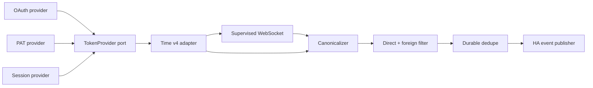
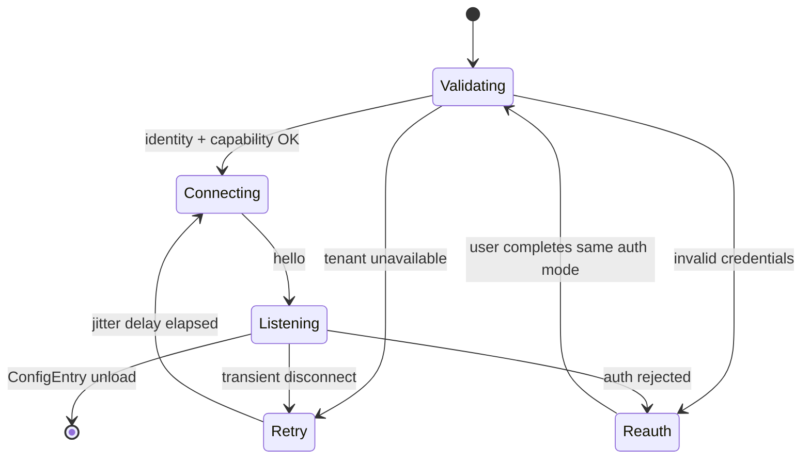

# Архитектура Time Messenger для Home Assistant

Этот документ — источник истины по архитектуре интеграции. Обновляйте его в
том же коммите, где меняется соответствующее архитектурное решение.
Построчные ссылки на код сюда не добавляем — они устаревают быстрее, чем
решения, которые описывает этот файл.

## Парадигма

**Hexagonal event-driven pipeline.** Time REST, WebSocket и три способа
авторизации — внешние адаптеры. Они превращают wire payload в канонический
`DirectMessage`; чистый pipeline выполняет классификацию и дедупликацию;
Home Assistant adapter публикует единственное публичное событие. Зависимости
направлены к моделям и портам домена, а не наружу к Time или Home Assistant.



## Архитектурные решения

### AD-1 — Hexagonal event-driven pipeline

Adapters зависят от канонических моделей и портов; pipeline не импортирует
Home Assistant или Time response-модели; HA publisher — последний adapter.
Предотвращает смешивание Time wire-протокола, авторизации и lifecycle Home
Assistant в одном обработчике.

### AD-2 — Одна персональная identity на ConfigEntry

Одна ConfigEntry владеет парой `(normalized_tenant_origin, time_user_id)` —
это её `unique_id`. Несколько ConfigEntry разрешены, но runtime и persistent
state изолированы по `entry_id`. Предотвращает смешивание аккаунтов,
reconnect-задач и dedupe-state.

### AD-3 — Три явных auth adapter за единым портом

Пользователь явно выбирает `oauth`, `pat` или `session`; каждый выдаёт
bearer через `TokenProvider`. Автоматический fallback между способами
запрещён. Подробности каждого способа — в разделе
[«Способы авторизации»](specs/2026-08-11-time-messenger-integration.md#способы-авторизации)
спеки интеграции.

### AD-4 — Identity и capability gate до запуска listener

Setup нормализует HTTPS origin, выполняет `GET /api/v4/users/me`, затем
аутентифицированный `/api/v4/websocket` до `hello`; фиксирует `user_id` и
`server_version`. Authenticated REST/WSS не следует redirects и никогда не
передаёт bearer на другой origin. Origin после identity binding неизменяем;
смена сервера проходит reconfigure и полный gate. HTTP разрешён только для
loopback test fixtures.

### AD-5 — Один supervised WebSocket на ConfigEntry

ConfigEntry создаёт ровно одну async-задачу после gate. Reconnect использует
full jitter в пределах последовательных caps `1, 2, 4, 8, 16, 32, 60` секунд;
cap сбрасывается после 60 секунд здорового соединения, не только после
`hello`. Unload сначала инвалидирует runtime generation, затем отменяет и
ожидает задачу и закрывает socket; late callbacks с прежней generation не
публикуют события и не запускают reauth. Auth failure инициирует reauth
вместо reconnect loop.

### AD-6 — Только новое чужое сообщение в канале `D`

Pipeline принимает только Time event `posted`, defensively декодирует post,
требует обычный пользовательский post с `post.type == ""`, подтверждает
channel type `D` из payload либо REST-backed cache и проверяет
`post.user_id != account_user_id`. Неизвестные identity, post type или
channel type обрабатываются fail-closed. В v1 типы `G`, `P`, `O` исключены
намеренно (см. Non-goals в спеке интеграции).

### AD-7 — Durable check-and-mark до публикации

Один per-entry async lock атомарно проверяет `post_id`, добавляет его и
сохраняет state через Home Assistant `Store` до `async_fire`. Хранятся не
более 5000 новейших ID и не дольше 24 часов. Ошибка сохранения запрещает
публикацию. Это даёт exactly-once suppression для replay после успешной
записи и at-most-once при process crash: HA event bus не имеет
транзакционного acknowledgement.

### AD-8 — Один версионированный HA event contract

Публичный event type — `time_messenger_event`; `schema_version=1`;
`type=direct_message`. Обязательные плоские поля: `schema_version`, `type`,
`config_entry_id`, `account_user_id`, `post_id`, `channel_id`,
`sender_user_id`, `message_text`, `text_redacted`, `created_at`;
`message_text` имеет тип `string|null`. Privacy option `include_message_text`
по умолчанию `false`: до явного opt-in поле равно `null`, а
`text_redacted=true`. Допустимы additive optional поля `sender_username`,
`root_id`, `file_ids`; удаление или переименование поля требует новой schema
version.

С версии 0.0.3 то же сообщение дополнительно доставляется в нативную
`EventEntity` (`event.py`) через entry-scoped dispatcher signal — это
транспорт того же payload, а не второй schema.

### AD-9 — Единая классификация отказов

`401` и terminal OAuth refresh failure запускают reauth; DNS/timeout/`5xx`
остаются в supervisor retry; `429` уважает `Retry-After` или rate-limit
reset; malformed event отбрасывается с redacted debug telemetry; unsupported
tenant capability создаёт Repair issue.

### AD-10 — Time v4 изолирован адаптером

Production-модули вне `api/` не импортируют Time response types. API v5 или
tenant deviation получает отдельный adapter и выбирается только явным
capability detection.

### AD-11 — Только процесс Home Assistant и исходящий TLS

Интеграция работает внутри одного HA Core, использует HA-managed `aiohttp`
session для HTTPS/WSS, всегда проверяет TLS и получает private CA только
через trust store хоста. Опция `verify_ssl: false`, webhook ingress и
companion daemon запрещены.

### AD-12 — Tenant acceptance является release gate

Probe на целевом tenant (`scripts/probe_time_tenant.py`) должен подтвердить
`hello`, один `posted` для `D`, отбрасывание `G/P/O` и self-post, replay
после reconnect без дубля, а также каждый из включённых auth modes.
Административно отключённый mode остаётся реализованным, но показывается
как unsupported.

### AD-13 — Раздельные unload и removal

Unload только останавливает runtime по AD-5. Удаление ConfigEntry
дополнительно очищает OAuth/bearer data и per-entry dedupe `Store`; для
session выполняет best-effort `/api/v4/users/logout`. OAuth/PAT remote
revoke разрешён только через подтверждённый endpoint выбранного tenant; его
отсутствие не блокирует локальное удаление.

## Конвенции согласованности

| Область | Конвенция |
| --- | --- |
| Domain и event | integration domain `time_messenger`; event `time_messenger_event`; Python модули/функции `snake_case`; канонические модели — существительные в единственном числе |
| IDs и время | Time IDs остаются opaque strings; Time milliseconds преобразуются в UTC ISO 8601 для `created_at`; internal watermark остаётся integer milliseconds |
| Config | connection/auth данные — `ConfigEntry.data`; privacy и tuning опции — `ConfigEntry.options`; runtime объекты — typed `ConfigEntry.runtime_data`; ConfigEntry напрямую не мутируется |
| Secrets | token, password, MFA, client secret и Authorization header никогда не попадают в repr, diagnostics, events или обычные logs |
| Errors | adapter exceptions нормализуются в `AuthError`, `TransientError`, `RateLimitError`, `UnsupportedCapability`, `ProtocolError`; UI-тексты локализуются |
| Async | network и storage только async; callbacks не выполняют I/O; созданные tasks регистрируются на unload |
| Event evolution | additive optional fields разрешены в schema v1; breaking changes выпускаются новым `schema_version`, старый publisher сохраняется на migration window |

## Стек

| Компонент | Версия |
| --- | --- |
| Home Assistant Core | `2026.8.1` — проверенный baseline и минимальная поддерживаемая версия |
| Python | `>=3.14.2` |
| `aiohttp` | предоставляется Home Assistant; не добавляется в manifest requirements |
| Time REST/WebSocket API | `v4` |

## Структура репозитория

```text
custom_components/time_messenger/
  __init__.py                  # ConfigEntry lifecycle и runtime_data
  manifest.json                # config_flow, application_credentials dependency
  config_flow.py               # выбор способа входа, валидация, reauth/reconfigure
  application_credentials.py   # OAuth endpoints, производные от tenant
  const.py                     # публичные имена и schema version
  models.py                    # канонические immutable модели и порты
  runtime.py                   # per-entry supervisor, composition root
  pipeline.py                  # canonicalize, filter, dedupe, publish orchestration
  dedupe.py                    # состояние на основе Home Assistant Store
  event.py                     # schema time_messenger_event, publisher и EventEntity
  api/
    auth.py                    # OAuth/PAT/session TokenProvider adapters
    client.py                  # Time REST v4 adapter и channel cache
    websocket.py               # authenticated listener и reconnect policy
    exceptions.py              # нормализованная классификация отказов
  diagnostics.py                # только redacted diagnostics
  translations/
    en.json
    ru.json
tests/
  components/time_messenger/   # config flow, pipeline, lifecycle, auth тесты
  fixtures/time_messenger/     # захваченные redacted REST/WS контракты
scripts/
  probe_time_tenant.py         # ручной AD-12 acceptance probe
  check_release_version.py     # version-parity gate для релиза
```



## Известные ограничения и отложенное

- **REST backfill после offline gap.** Time документирует per-channel
  `since`, но не глобальный replay/cursor. v1 гарантирует reconnect и
  отсутствие дублей, но не gap-free delivery.
- **Group direct (`G`) и private (`P`) каналы.** Вне scope, пока определение
  личного сообщения не расширится явно.
- **EventEntity, device и sensor platforms.** EventEntity добавлен в 0.0.3;
  device/sensor platforms для message metadata остаются нерассмотренными.
- **Распределение и CI.** HACS/manual packaging и release automation
  описаны отдельно в [спеке HACS-упаковки](specs/2026-08-11-hacs-packaging.md)
  и не меняют runtime boundaries из этого документа.

## Связанные документы

- [docs/specs/2026-08-11-time-messenger-integration.md](specs/2026-08-11-time-messenger-integration.md) — контракт core-функциональности (capabilities, constraints, non-goals).
- [docs/specs/2026-08-11-hacs-packaging.md](specs/2026-08-11-hacs-packaging.md) — контракт HACS-упаковки, релизов и CI-валидации.
- [docs/style-guide.md](style-guide.md) — голос и тон пользовательской документации.
